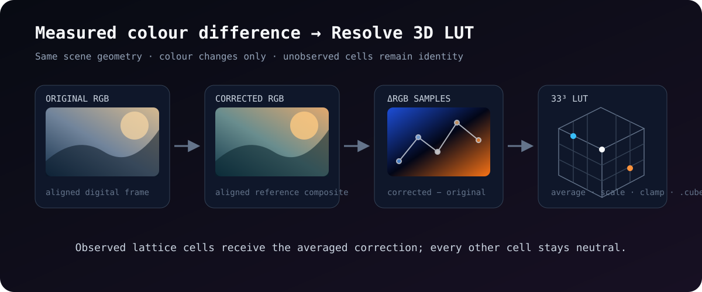

# Interstellar LUT Generator

Experimental Python scripts that turn an aligned original/corrected image pair into a 33×33×33 DaVinci Resolve `.cube` LUT.
I built the project to investigate whether colour differences measured from a film-reference composite could be transferred back onto a high-detail digital frame without replacing its spatial detail.

The visible result is a standard 3D LUT such as `Interstellar_Cliff_RGB_OK.cube`, ready to import into Resolve for visual evaluation.



## Method

The primary script preserves a direct RGB delta-mapping experiment:

1. Load one `Original_*` image and one aligned `Corrected_*` image.
2. Normalize 8-bit or 16-bit pixel values to the range 0–1.
3. Quantize each original RGB sample into a 33³ grid cell.
4. Accumulate and average the corrected-minus-original RGB delta in every observed cell.
5. Scale the measured delta and add it to an identity LUT.
6. Clamp the result and write a Resolve-compatible `.cube` file.

Grid cells that were not observed in the reference frame remain at their identity values. The script changes colour only; all alignment and reference-image preparation happens before LUT generation.

## Run

Requires Python 3.10 or later.

```bash
python3 -m venv .venv
source .venv/bin/activate
python -m pip install -r requirements.txt
```

Place one aligned pair in the working directory:

```text
Original_reference.tif
Corrected_reference.tif
```

Then run:

```bash
python gen_lut.py
```

The default experiment uses a 33³ grid, applies the measured delta at 60% strength, and writes `Interstellar_Cliff_RGB_OK.cube`.

## Included scripts

| File | Purpose |
|---|---|
| `gen_lut.py` | Primary delta-averaging experiment with the Resolve grid order used by the later workflow. |
| `test.py` | Earlier full-strength RGB delta variant with explicit missing-file and resolution checks. |
| `sanity.py` | Write a neutral 33³ identity cube for channel/order checks in Resolve. |

## Reference workflow

The original workflow prepared the two input images manually in DaVinci Resolve. A digital frame and a film reference were aligned first. The normal digital frame became `Original_*`; a colour-reference composite became `Corrected_*`. Those files must have identical dimensions and should already represent the same scene geometry.

Resolve project archives, embedded stills, source-film frames, disc-derived media, and generated LUTs are deliberately excluded from the public repository. The source-only history contains only the Python experiments and their documentation.

## Scope

This is a research prototype, not a calibrated restoration pipeline. A single image pair samples only a small part of RGB space; unobserved bins remain neutral, and the scripts do not interpolate or smooth the sparse measurements. They also do not perform colour-space conversion, exposure matching, perceptual optimization, or validation against a film projection. The output is intended for inspection and further experimentation, not as a claim of recovered theatrical colour.
