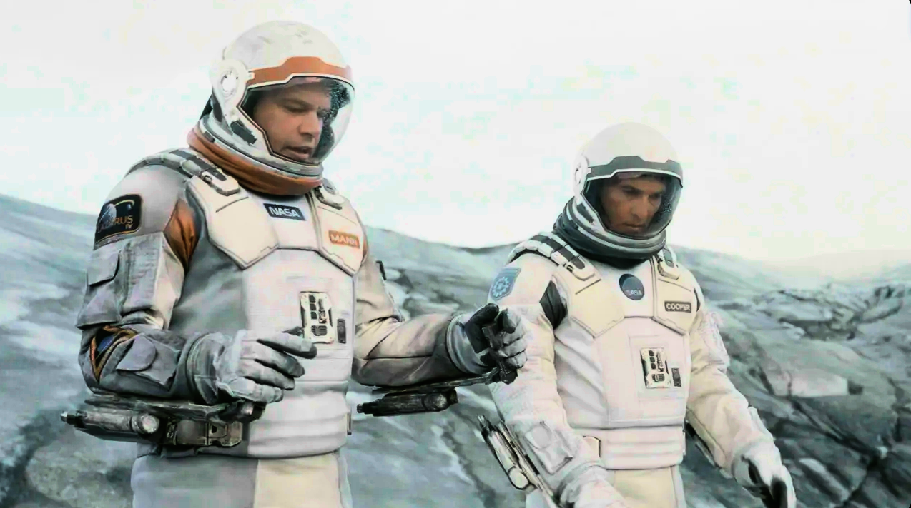
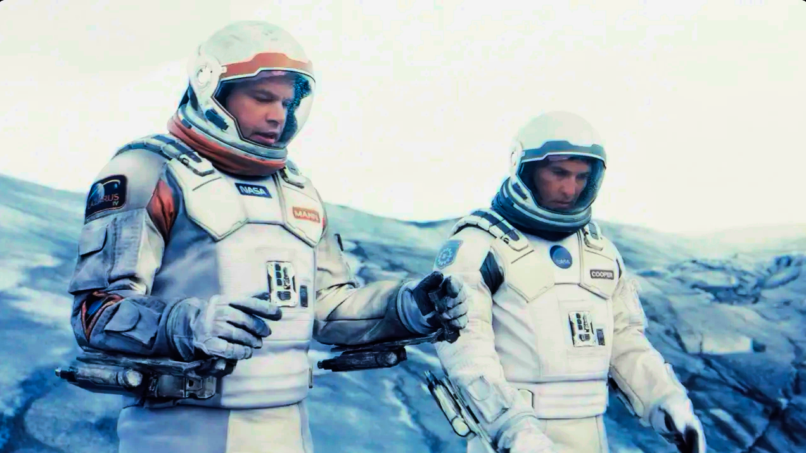
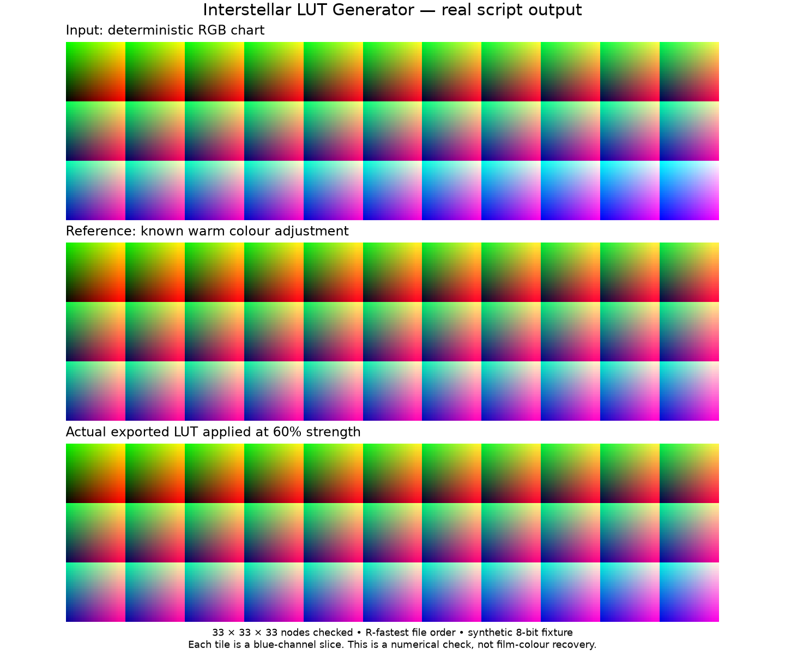

# Interstellar LUT Generator

Experimental Python scripts that turn an aligned original/corrected image pair into a 33×33×33 DaVinci Resolve `.cube` LUT.
I built the project to investigate whether colour differences measured from a film-reference composite could be transferred back onto a high-detail digital frame without replacing its spatial detail.

The visible result is a standard 3D LUT such as `Interstellar_Cliff_RGB_OK.cube`, ready to import into Resolve for visual evaluation.

## Film-cell LUT example

Both panels show the same frame from the 4K Blu-ray of *Interstellar*. The LUT
was generated using an IMAX film cell of that frame as the colour reference.
The bluer panel shows the LUT applied to the Blu-ray frame.

| Before LUT | After film-cell LUT |
| --- | --- |
|  |  |

Both images use the same Rec.2020/PQ 1,000-nit to Rec.709 SDR conversion.
See the [display conversion recipe](docs/film_cell_example_15SEP2026.md).

## Method

The primary script preserves a direct RGB delta-mapping experiment:

1. Load one `Original_*` image and one aligned `Corrected_*` image.
2. Normalize input values using the script's pixel-range heuristic.
3. Quantize each original RGB sample into a 33³ grid cell.
4. Accumulate and average the corrected-minus-original RGB delta in every observed cell.
5. Scale the measured delta and add it to an identity LUT.
6. Clamp the result and write a Resolve-compatible `.cube` file.

Grid cells that were not observed in the reference frame remain at their identity values. The script changes colour only; all alignment and reference-image preparation happens before LUT generation.

## Run

Requires Python 3.10 or later.

```bash
python3 -m venv .venv
source .venv/bin/activate
python -m pip install -r requirements.txt
```

Place one aligned pair in the working directory:

```text
Original_reference.tif
Corrected_reference.tif
```

Then run:

```bash
python gen_lut.py
```

The default experiment uses a 33³ grid, applies the measured delta at 60% strength, and writes `Interstellar_Cliff_RGB_OK.cube`.

Use a dedicated directory with exactly one matching image pair. If the pair is
missing or ambiguous, the current primary script writes an identity cube.

## Reproducible generator check



This separate chart comes from the actual `gen_lut.py` output. It supplies a
synthetic RGB chart and a known colour adjustment, reads the exported `.cube`,
and applies it to the chart.

### Reproduce the chart

```bash
python -m pip install matplotlib
python examples/generate_demo.py --output-dir /path/outside/git/lut_demo
```

The command checks all 35,937 exported nodes, their finite range, and the
R-fastest channel order against the known adjustment. It writes the figure to
`docs/lut_verification.png`. Inputs and the generated LUT stay in the selected
output directory. This check uses an 8-bit chart; it does not verify 16-bit
colour input or a DaVinci Resolve import.

## Included scripts

| File | Purpose |
|---|---|
| `gen_lut.py` | Primary delta-averaging experiment with the Resolve grid order used by the later workflow. |
| `test.py` | Earlier full-strength RGB delta variant with explicit missing-file and resolution checks. |
| `sanity.py` | Write a neutral 33³ identity cube for channel/order checks in Resolve. |
| `examples/generate_demo.py` | Run the primary script on a known RGB chart, check the exported cube, and plot the applied result. |
| `examples/convert_hdr_pair.py` | Apply one explicit HDR-to-SDR display transform to a before/after PNG pair. Requires FFmpeg. |

## Reference workflow

The original workflow prepared the two input images manually in DaVinci Resolve. A digital frame and a film reference were aligned first. The normal digital frame became `Original_*`; a colour-reference composite became `Corrected_*`. Those files must have identical dimensions and should already represent the same scene geometry.

The two Rec.709 demonstration images above are included for project presentation. Resolve project archives, source-film files, film-cell scans, original reference pairs, and generated LUTs remain outside this public repository.

## Scope

This is a research prototype, not a calibrated restoration pipeline. A normal
image pair samples only a small part of RGB space; unobserved bins remain
neutral. The verification chart deliberately covers every bin. The core LUT scripts do
not interpolate sparse measurements, convert colour spaces, match exposure,
or validate against a film projection. Input scaling is inferred from pixel
values, so bit depth and channel handling need further validation. The output
does not establish recovered theatrical colour.
